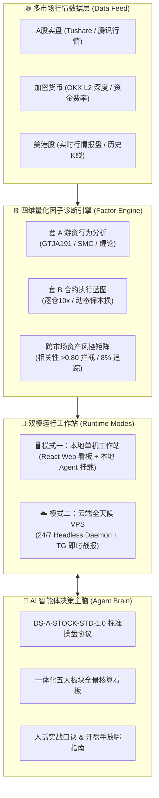

<div align="center">


# Vibe-Trading Suite
### 个人多市场量化交易系统与 AI 智能体工作站

[](LICENSE)
[](docker-compose.yml)
[](skills/trading-expert-ops/references/ds_a_stock_std_1.0.md)
[](skills/trading-expert-ops/references/suite_b_blueprint_v2.0.md)
[](https://python.org)
[](app/frontend)
[](https://github.com/jiancraft/vibe-trading-suite/pulls)

<p align="center">
  <b>一套融合「单机可视化看盘软件 (React/Web)」与「AI 智能体主脑 (Standard Agent Skill)」的全栈量化交易解决方案。</b>
</p>

[✨ 核心特性](#-核心特性) •
[🏗️ 系统全景架构](#️-系统全景架构) •
[🚀 两种部署模式](#-极速上手两种运行模式) •
[🤖 挂载 AI 智能体](#-智能体挂载与指令规范-agent-skills) •
[🛡️ 工业级风控矩阵](#️-工业级风控纪律矩阵) •
[📖 开源合规](#️-开源协议与致谢)

</div>

> ℹ️ **开源与上游致谢**：本项目基于 [HKUDS/Vibe-Trading](https://github.com/HKUDS/Vibe-Trading)（MIT 许可）架构深度开发与扩展，内嵌了 A股/美港股/加密货币多市场量化因子、OKX 逐仓实盘风控与标准化 AI 智能体技能。完整第三方声明详见 [NOTICE](NOTICE)。

---

## ✨ 核心特性

| 模块 | 技术实现 | 核心价值 |
| :--- | :--- | :--- |
| **套 A：A股短线游资量价点火** | 国泰君安 191 因子、SMC 机构订单块、缠论笔中枢分解 | 政策市严守确定性，6 选 1 唯一明确操作标签，浮亏绝对禁止加仓 |
| **套 B：加密合约 24/7 全天候实盘** | OKX 逐仓物理隔离、资金费率避震窗、盘口价差锁 | 三阶动态出场体系（40% TP1 推保本 / 30% TP2 / 30% Trailing 追踪） |
| **美港股核心持仓动量监控** | 90 日日度收益率相关性矩阵、动态 8% 移动止损线 | 拦截同质化资产假分散（>0.80 预警），防守生命线纪律离场 |
| **全模态 AI 智能体工作站** | 标准化 `trading-expert-ops` Agent Skill | 无缝挂载 Claude Code、OpenAI Codex、Antigravity，化身首席操盘参谋 |
| **单机极客控制台** | React 18 + TailwindCSS + Docker 容器化 | 零配置一键启动本地 Web 操盘大屏（8899 端口），隐私数据 100% 留存本地 |
| **工业级硬核防爆仓安全网** | 强制逐仓隔离、Compose 强口令门禁、自愈看门狗 | 杜绝弱口令公网裸露，断网/重启 100% 自动拉起与自愈接管 |

---

## 🏗️ 系统全景架构



---

## 🚀 极速上手：两种运行模式

### 模式一：本地单机工作站 (Local Workstation)
适合日内盯盘、复盘分析、股票诊断与策略回测。零服务器费用，隐私数据 100% 留在本地机器。

```bash
# 1. 克隆代码仓库
git clone https://github.com/jiancraft/vibe-trading-suite.git
cd vibe-trading-suite

# 2. 复制配置模板并填入您的自选标的 (可选)
cp .env.example .env
cp config/portfolio.example.json config/portfolio.json

# 3. 启动单机可视化交易软件 (Docker Web 控制台)
./run.sh --web
# 浏览器打开: http://localhost:8899 (默认安全绑定本地 127.0.0.1)

# 4. (可选) 将智能体量化专家技能挂载至本地 AI
./run.sh --skill
```

### 模式二：云端全天候无人值守实盘 (Cloud 24/7 VPS Daemon)
适合加密合约 7×24 小时高频实盘、防插针保本损推升与 Telegram 手机即时战报推送。

```bash
# 在您的云服务器 (Ubuntu/Debian) 上执行：
git clone https://github.com/jiancraft/vibe-trading-suite.git /opt/vibe-trading
cd /opt/vibe-trading
cp .env.example .env

# 编辑配置填入您的 OKX API 与 Telegram Bot Token
# 强烈建议设置 >= 24 位高强度口令: openssl rand -hex 24
nano .env

# 执行一键云端部署向导 (自带 Watchdog 每分钟自愈守护)
bash deploy-cloud.sh
```

---

## 🔍 秒级命令行盘面诊断示例 (CLI Doctor)

无需配置复杂的 API 密钥，开箱即用：

```bash
# 诊断 A股核心标的 (贵州茅台)
./run.sh --doctor 600519

# 诊断 加密合约核心标的 (比特币永续合约)
./run.sh --doctor BTC

# 诊断 美股核心指数 (标普500 ETF)
./run.sh --doctor SPY
```

#### 诊断输出实况预览 (以贵州茅台为例)：
```text
### 【贵州茅台（600519）盘面量化与风控研判】

- 市场定位：A股短线 | 当前货币：CNY
- 实时现价：1258.62 CNY （涨跌额: +23.04, 涨跌幅: +1.86%）
- 今日极值：最高 1268.00 | 最低 1236.05 | 今开 1239.53 | 昨收 1235.58
- 换手率：0.31%

🎯 短线量价结构与买卖点：
- 日内阻力位 (R1)：1272.40 CNY
- 日内支撑位 (S1)：1240.45 CNY
- 量价形态研判：区间箱体震荡。严格按支撑位 1240.45 与阻力位 1272.40 设置止盈止损。
- 失效条件：若跌破今日最低价 1236.05，短线做多逻辑失效。
```

---

## 🤖 智能体挂载与指令规范 (Agent Skills)

本仓库提供标准化的 **`trading-expert-ops` Skill**（位于 `skills/trading-expert-ops/`）。  
任何遵循现代 Agent Skill 规范的智能体（**Claude Code**、**OpenAI Codex**、**Antigravity**）均可直接挂载。

挂载后，智能体将严格执行 **DS-A-STOCK-STD-1.0** 标准操盘协议，在对话中直接支持：
* `“诊断一下 600519”` —— 提取短线筹码与 SMC 订单块点位；
* `“分析 BTC-USDT 盘口深度与费率”` —— 校验 10x 逐仓安全垫与资金费率避震窗；
* `“检查当前持仓组合相关性”` —— 预警 >0.80 假分散风险。

### 一体化全景输出格式（严禁车轱辘套话）：
1. **【资产与盘面全景核算看板】**
2. **【量化支撑阻力点位表与明确操作标签】**（持仓待涨 / 建仓上车 / 回踩低吸 / 逢高减仓 / 破位止损 / 空仓观望）
3. **【大白话手把手操盘指南】**（人话实战口诀、手把手开盘手放哪、防诱多骗线）
4. **【现金机动仓位配置预案】**
5. **【极端风控与止损生命线】**

---

## 🛡️ 工业级风控纪律矩阵 (DS-A-STOCK-STD-1.0)

| 核心死律 | 量化执行标准 | 触发动作 |
| :--- | :--- | :--- |
| **1. 唯一操作标签** | 6 选 1 绝对明确：持仓待涨 / 建仓上车 / 回踩低吸 / 逢高减仓 / 破位止损 / 空仓观望 | 严禁模棱两可与车轱辘废话 |
| **2. 三色大盘闸门** | 红灯进攻（仓位<=80%）/ 黄灯震荡（仓位<=50%）/ 蓝黑灯退潮 | 退潮期强制空仓避险，严禁新开仓 |
| **3. 建仓区间宽度** | 建仓区间宽度严格 `<= 3%`，必须带明确有效确认位与失效止损位 | 击穿确认位视为信号无效 |
| **4. 浮亏严禁加仓** | 持仓浮亏时绝对禁止摊平成本加仓 | 仅在浮盈且突破关键阻力时顺势追加 |
| **5. 拒绝投顾套话** | 不主观预测行情走势，只给出量化支撑阻力与确定性盈亏比 | 击破止损保护线 100% 纪律离场 |

---

## 📂 仓库目录结构

```text
vibe-trading-suite/
├── .env.example                   # 环境变量配置模板 (AI Key / OKX / Telegram)
├── docker-compose.yml             # Docker 容器化编排 (带 BIND_ADDR 回环保护)
├── run.sh                         # 本地多模一键启动器 (--web / --skill / --doctor)
├── deploy-cloud.sh                # 云端 VPS 无人值守一键部署向导 (带 Watchdog)
├── LICENSE                        # MIT 开源协议文本
├── NOTICE                         # 上游 HKUDS / Qlib 等版权归属与致谢声明
├── README.md                      # 项目主控说明文档
├── config/
│   ├── portfolio.example.json     # 自选股与持仓监控配置模板 (大盘基准公开示例)
│   └── approved_runs.example.json # 回测代码 SHA-256 指纹审核清单模板
├── scripts/
│   ├── stock_doctor.py            # 多市场毫秒级实时量化行情与风控诊断脚本
│   ├── multi_market_factor_engine.py # 四维因子计算与组合风险引擎
│   └── mcp-readonly.py            # 安全只读 MCP 服务驱动 (带代码哈希防篡改)
├── skills/
│   └── trading-expert-ops/        # 标准化 AI 智能体主控专家技能
│       ├── SKILL.md               # 技能元数据与核心操盘死律
│       └── references/            # 策略协议规范 (DS-A-STOCK / Suite-B / 风控矩阵)
└── app/                           # 完整底层交易引擎 (React 前端 + Python 容器服务)
```

---

## ⚖️ 开源协议与致谢

- 本项目遵循 **[MIT 许可证](LICENSE)** 开源发布。
- 本项目是在 **[HKUDS/Vibe-Trading](https://github.com/HKUDS/Vibe-Trading)** 优秀的开源交易架构基础上演进开发，向 HKUDS 开源社区致以由衷敬意！
- 投资有风险，量化需谨慎。本项目仅供学术研究、个人量化开发及模拟交易使用，使用者须自行承担实盘交易的一切资金风险。
