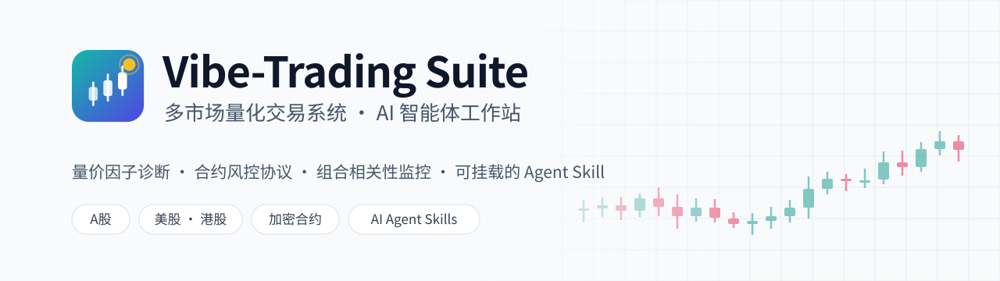
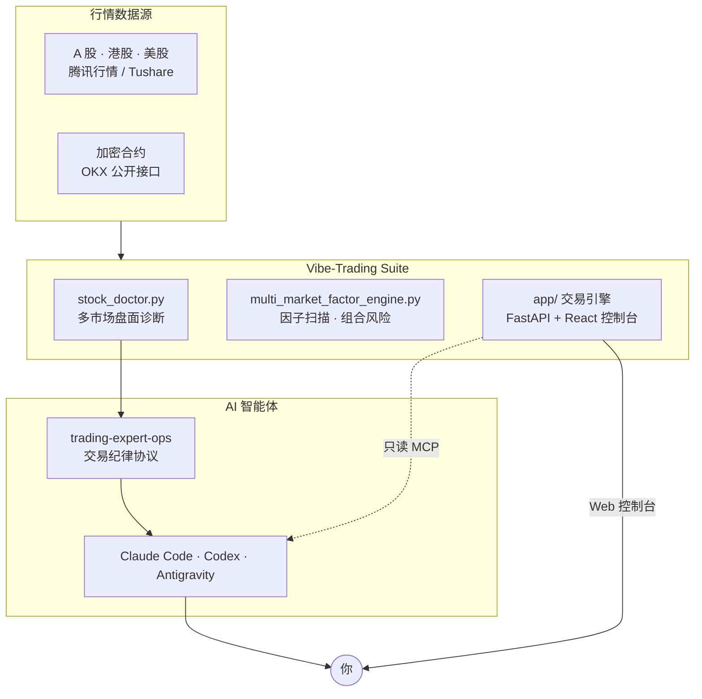

<div align="center">

<picture>
  <source media="(prefers-color-scheme: dark)" srcset="assets/banner-dark.svg">
  
</picture>

<br/>

[](LICENSE)
[](app/pyproject.toml)
[](app/frontend/package.json)
[](docker-compose.yml)
[](https://github.com/HKUDS/Vibe-Trading)

**把多市场行情诊断、交易纪律协议和 AI 智能体技能装进同一个工作站。**<br/>
<sub>A multi-market quant workstation with agent skills for A-shares, US/HK equities and crypto perpetuals — built on <a href="https://github.com/HKUDS/Vibe-Trading">HKUDS/Vibe-Trading</a>.</sub>

[快速开始](#-快速开始) · [核心能力](#-核心能力) · [系统架构](#-系统架构) · [智能体技能](#-智能体技能) · [交易纪律](#-交易纪律) · [安全设计](#-安全设计) · [致谢](#-许可与致谢)

</div>

> [!CAUTION]
> **本项目仅供量化研究、学习和模拟交易使用，不构成任何投资建议。** OKX 连接默认使用模拟盘（`profile: paper`）。切换到实盘前，请先在模拟盘充分验证，并自行承担全部资金风险。

<br/>

## ✨ 核心能力

<table>
<tr>
<td width="50%" valign="top">

### 📈 A 股短线诊断
国泰君安 191 因子、SMC 订单块、缠论笔与中枢。输出**唯一明确**的操作标签和失效止损位，不给模棱两可的结论。

</td>
<td width="50%" valign="top">

### ⚡ 加密合约风控
资金费率结算避让窗、盘口价差保护、三阶分批出场（40% / 30% / 30%），数据来自 OKX 公开接口。

</td>
</tr>
<tr>
<td width="50%" valign="top">

### 🌐 美港股组合监控
90 日收益率相关性矩阵，相关系数超过 0.80 时提示"假分散"；按阶段高点回撤 8% 计算移动止损线。

</td>
<td width="50%" valign="top">

### 🤖 可挂载的 Agent Skill
标准化的 `trading-expert-ops` 技能，可接入 Claude Code、OpenAI Codex、Antigravity 等支持 Agent Skill 的工具。

</td>
</tr>
<tr>
<td width="50%" valign="top">

### 🖥️ 本地 Web 控制台
基于上游 React 19 + FastAPI 控制台，Docker 一键启动，默认只监听本机 `127.0.0.1:8899`。

</td>
<td width="50%" valign="top">

### 🛡️ 默认安全
强制启动口令、默认仅本机访问、回测代码 SHA-256 指纹校验，详见[安全设计](#-安全设计)。

</td>
</tr>
</table>

<br/>

## 🚀 快速开始

**环境要求**：Docker 与 Docker Compose v2；只使用命令行诊断时，有 Python 3.11+ 即可。

```bash
git clone https://github.com/jiancraft/vibe-trading-suite.git
cd vibe-trading-suite

./run.sh --web      # 首次运行会自动生成 .env 和 48 位随机访问口令
```

启动后在浏览器打开 **http://localhost:8899**，访问口令在 `.env` 的 `API_AUTH_KEY` 中。

<details>
<summary><b>其他启动方式</b></summary>

<br/>

| 命令 | 作用 |
| :--- | :--- |
| `./run.sh --web` | 启动本地 Web 控制台 |
| `./run.sh --skill` | 把 `trading-expert-ops` 技能链接到 `~/.agents/skills/` |
| `./run.sh --all` | 同时执行以上两项 |
| `./run.sh --doctor <代码>` | 命令行行情诊断，无需任何 API Key |

如需自定义关注列表：

```bash
cp config/portfolio.example.json config/portfolio.json   # 该文件已被 .gitignore 忽略
```

</details>

<details>
<summary><b>部署到云服务器（7×24 运行）</b></summary>

<br/>

```bash
# 在 Ubuntu / Debian 服务器上执行
git clone https://github.com/jiancraft/vibe-trading-suite.git /opt/vibe-trading
cd /opt/vibe-trading
cp .env.example .env
nano .env                  # API_AUTH_KEY 至少 24 位，可用 openssl rand -hex 24 生成
bash deploy-cloud.sh       # 口令不合格会拒绝部署；同时安装每分钟巡检的自愈 watchdog
```

服务默认仍只监听 `127.0.0.1`。**推荐在前面加一层 Nginx 或 Caddy 反向代理并启用 HTTPS**；只有确实需要直接公网访问时，才在 `.env` 中设置 `BIND_ADDR=0.0.0.0`。

</details>

<br/>

## 🔍 命令行诊断

```bash
./run.sh --doctor 600519      # A 股：贵州茅台
./run.sh --doctor BTC         # 加密货币：BTC-USDT 永续合约
./run.sh --doctor SPY         # 美股：标普 500 ETF
```

<details>
<summary><b>输出示例（贵州茅台）</b></summary>

```text
### 【贵州茅台（600519）盘面量化与风控研判】

- 市场定位：A股短线 | 当前货币：CNY
- 实时现价：1258.62 CNY （涨跌额: +23.04, 涨跌幅: +1.86%）
- 今日极值：最高 1268.00 | 最低 1236.05 | 今开 1239.53 | 昨收 1235.58
- 换手率：0.31%

#### 🎯 短线量价结构与买卖点：
- 日内阻力位 (R1)：1272.40 CNY
- 日内支撑位 (S1)：1240.45 CNY
- 量价形态研判：区间箱体震荡。严格按支撑位 1240.45 与阻力位 1272.40 设置止盈止损。
- 失效条件：若跌破今日最低价 1236.05，短线做多逻辑失效。
```

<sub>以上为示例数据，行情来自腾讯与 OKX 的公开接口。</sub>

</details>

<br/>

## 🧭 系统架构



<br/>

## 🤖 智能体技能

执行 `./run.sh --skill` 后，支持 Agent Skill 的智能体会加载 `trading-expert-ops`，按 **DS-A-STOCK-STD-1.0** 协议回答问题。例如：

| 你可以这样问 | 智能体会做什么 |
| :--- | :--- |
| 诊断一下 600519 | 计算支撑阻力位，给出唯一操作标签和失效止损位 |
| 分析 BTC-USDT 的盘口和资金费率 | 检查价差保护、费率结算避让窗和止损止盈位 |
| 检查我的持仓相关性 | 计算相关系数，超过 0.80 时提示同质化风险 |

<details>
<summary><b>统一输出格式</b></summary>

1. 资产与盘面全景核算看板
2. 量化支撑阻力点位表与明确操作标签：持仓待涨 / 建仓上车 / 回踩低吸 / 逢高减仓 / 破位止损 / 空仓观望
3. 大白话操盘指南：实战口诀、开盘时的操作、如何识别诱多
4. 现金机动仓位配置预案
5. 极端风控与止损生命线

</details>

<br/>

## 📐 交易纪律

| # | 纪律 | 具体规则 |
| :-: | :--- | :--- |
| 1 | 唯一操作标签 | 六选一，禁止"长期向好但短期承压"一类模糊表述 |
| 2 | 三色大盘闸门 | 🔴 进攻期仓位上限 80% · 🟡 震荡期 40–50% · ⚫ 退潮期强制空仓 |
| 3 | 建仓区间 | 区间宽度不超过 3%，必须同时给出确认位和失效止损位 |
| 4 | 不摊平亏损 | 浮亏绝不加仓；只有浮盈且突破确认后才按条件加仓 |
| 5 | 只给可执行信息 | 不预测走势，只给量化点位和盈亏比 |

<sub>完整协议见 <a href="skills/trading-expert-ops/references/ds_a_stock_std_1.0.md">DS-A-STOCK-STD-1.0</a>、<a href="skills/trading-expert-ops/references/suite_b_blueprint_v2.0.md">Suite-B v2.0</a> 和 <a href="skills/trading-expert-ops/references/risk_matrix_rules.md">风控矩阵</a>。</sub>

<br/>

## 🔐 安全设计

| 机制 | 说明 |
| :--- | :--- |
| 强制访问口令 | `API_AUTH_KEY` 为空时 Docker Compose 直接拒绝启动；云端部署还要求口令至少 24 位 |
| 默认仅本机访问 | 端口默认绑定 `127.0.0.1`，需要在 `.env` 中显式设置才会对外开放 |
| 回测代码指纹 | `mcp-readonly.py` 只执行已登记且 SHA-256 一致的策略；缺少清单时一律拒绝 |
| 默认模拟盘 | OKX 连接默认使用 `paper` 模式，切换实盘需要手动修改配置 |
| 敏感文件隔离 | `.env`、`portfolio.json`、`approved_runs.json`、私钥和数据目录均已加入 `.gitignore` |

> [!NOTE]
> 使用云端大模型（DeepSeek、OpenAI、Gemini 等）时，你的对话内容会发送给对应的服务商。如果涉及敏感的持仓信息，请自行评估。

<br/>

## 📂 目录结构

```text
vibe-trading-suite/
├── run.sh                             # 本地启动器：--web / --skill / --doctor / --all
├── deploy-cloud.sh                    # 云服务器部署（口令检查 + 自愈 watchdog）
├── docker-compose.yml                 # 默认绑定 127.0.0.1，强制要求访问口令
├── .env.example                       # 环境变量模板
├── config/
│   ├── portfolio.example.json         # 关注列表示例（公开基准标的）
│   └── approved_runs.example.json     # 回测代码指纹清单示例
├── scripts/
│   ├── stock_doctor.py                # 多市场盘面诊断
│   ├── multi_market_factor_engine.py  # 因子扫描与组合风险
│   └── mcp-readonly.py                # 只读 MCP 服务（带回测指纹校验）
├── skills/trading-expert-ops/         # Agent Skill 与交易协议文档
├── app/                               # 上游 HKUDS/Vibe-Trading 交易引擎
├── assets/                            # README 用到的 Logo 和横幅
├── LICENSE
└── NOTICE
```

<br/>

## 📜 许可与致谢

- 本项目基于 **[HKUDS/Vibe-Trading](https://github.com/HKUDS/Vibe-Trading)**（MIT 许可）开发与扩展，感谢 HKUDS 团队和社区的开源工作。
- 本项目以 [MIT 许可证](LICENSE) 发布。上游项目、Microsoft Qlib（Apache 2.0）以及相关因子文献的出处声明见 [NOTICE](NOTICE)。
- 投资有风险。本项目的任何输出都不构成投资建议，使用者需自行承担实盘交易的全部风险。

<div align="center">
<br/>
<sub>如果这个项目对你有帮助，欢迎点一个 ⭐ Star，也欢迎提交 <a href="https://github.com/jiancraft/vibe-trading-suite/issues">Issue</a> 和 <a href="https://github.com/jiancraft/vibe-trading-suite/pulls">PR</a>。</sub>
</div>
